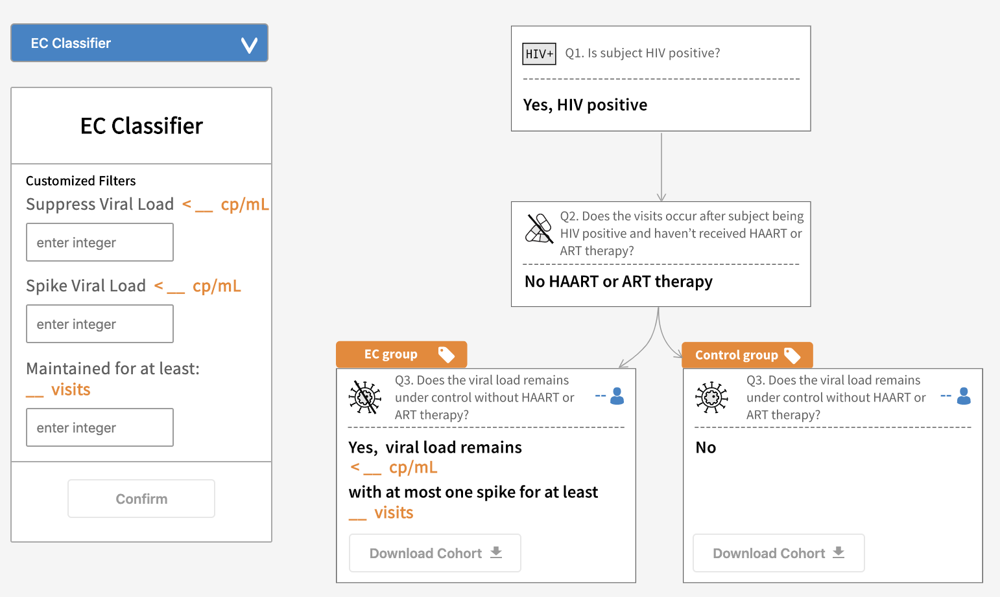

# HIV Cohort Selection App
### Try it out at https://aids.niaiddata.org/analysis/ndhHIV
------------------------

The HIV Cohort Selection App enables researchers to query the HIV infection controller types (Long-Term Non-Progressors, Post-Treatment Controllers and Elite Controllers) based on the customized rate of HIV progression.


Example of HIV Cohort Selection App:

## Background
The human immunodeficiency virus (HIV) infection is a dynamic process and has a variable rate of progression in infected people. Despite the varying disease progression rates, the majority of HIV-infected individuals eventually progress to AIDS. Interestingly, a small group of people who are HIV positive remain healthy for long periods of time without medications. These people, known as Long-Term Non-Progressors, Post-Treatment Controllers and Elite Controllers, have properties within their immune systems that control the virus. They can help researchers determine how their immune systems control HIV disease. This knowledge is critical for developing new treatments and vaccines.

Currently, different studies have used different criteria to define controller groups which makes comparison difficult. In addition, conventional cohort selection requires deep technology knowledge and a particular data source. We propose an effective tool which allows biomedical experts to define the cohort selection expressing the characteristics of the desired population using textual filters.

----------------------------------------

##  Implementation

### (1) PTC
**Post-treatment controller(PTC)**: a patient received treatment before and is able to maintain the viral load undetectable for a prolonged period after therapy discontinues.

Decision tree of Post-Treatment Controller:


**User will type in the time period Y and viral load threshold X, and the app will show the count for PTC case and control subjects. And have buttons to download the clinical manifest for them.**


**Definitions:**

  *  Patients ```hiv_status``` are positive, have consecutive follow ups for ```Y``` months with HAART treatment and ```viral load < X```
  *  The consecutive window has an immediate next follow up WITHOUT HAART treatment and ```viral_load < X```

**Known limitations:**


When visits are missing between 2 follow ups, we treat them as adjacent even if they are not. For example, two consecutive visits, 10 and 14, will be treated as 6 months apart, even though the time may be much greater.


-----------------------------

### (2) LTNP
**Long-term Nonprogressor (LTNP)**: a patient with a high CD4 immune cell count (CD4 count is like a snapshot of how well your immune system is functioning) for a long period of time in the absence of HIV therapy. This is an immunologic definition.

Decision tree of Long-term Nonprogressor:


**User will type in the time period X and CD4 threshold Y, and the app will show the count for LTNP case and control subjects and have buttons to download the clinical manifest for them.**

**Definitions:**

  * Patients ```hiv_status``` are positive for ```X ``` years
  * Patients never received HAART treatment and maintain ```CD4 > Y``` for those ```X``` years

**Known limitations:**
  * This algorithm assumes that once a subject is HIV positive, they remain HIV positive
  * If followups are missing between hiv positive confirmation and present, the CD4 count is assumed to remain under the threshold for the missing visits

-------------------------------------

### (3) EC
**Elite controller (EC)**: a patient with undetectable viral load for a long period of time in the absence of treatment. This is a virologic definition.

Decision tree of Elite controller:



**User will type in the time period Y and viral load threshold X, and the app will show the count for EC case and control subjects. And have buttons to download the clinical manifest for them.**


**Definitions:**

  * Patients' ```hiv_status``` are positive
  * Patients have never received HAART treatment and have consecutive follow ups for ```Y``` months with ```viral load < X```

  -----------------------------------------------

  For questions about the HIV Cohort Selection App, please contact cdis@uchicago.edu or create an issue ticket at https://github.com/uc-cdis/data-portal/issues
