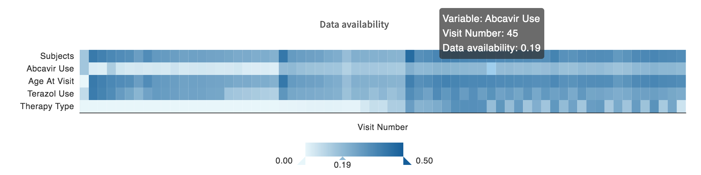

# Data Availability Tool

The DAT is a heatmap in the exploration page.

It can be used to show data availability across projects. It works well both for categorical data and for longitudinal data.

Example of a DAT for longitudinal data:


## Configuration

The DAT requires the `dataAvailabilityToolConfig` block in `gitops.json`. This is the configuration for the example DAT above:

```
"dataAvailabilityToolConfig": {
    "guppyConfig": {
        "dataType": "follow_up",
        "mainField": "visit_number",
        "mainFieldTitle": "Visit number",
        "mainFieldIsNumeric": true,
        "aggFields": [
            "age_at_visit",
            "abcv",
            "thrpyv",
            "trzv"
        ],
        "fieldMapping": [
            {"field": "abcv", "name": "Abcavir Use"},
            {"field": "thrpyv", "name": "Therapy Type"},
            {"field": "trzv", "name": "Terazol Use"},
            {"field": "subject_id", "name": "Subjects"}
        ],
        "colorRange": ["#EBF7FB", "#1769A3"]
    }
}
```

* `dataType`, `mainField` and `aggFields` will be provided to the Guppy nested aggregation query. The values provided here must be defined in the configuration file `etlMapping.yaml`:
  * `dataType` is an ElasticSearch document type (`doc_type` in `etlMapping.yaml`)
  * `mainField` and `aggFields` are properties of this document type
* `mainFieldTitle` will be the name of the X axis, associated with values of `mainField`
* `mainFieldIsNumeric`: Gupppy needs to know whether `mainField` takes numeric or categorical values _(optional, default is false)_
* `fieldMapping`: fields for which a mapping is _not_ provided will be capitalized, for example `age_at_visit` will be displayed `Age At Visit` _(optional)_
* `colorRange`: a list of two hex color codes, the first one will be used for availabilities of 0% and the second one will be used for the greatest availability value found in the heatmap _(optional, default is `["#EBF7FB", "#1769A3"]`)_

An additional row is always displayed using the values for the configuration field `dataExplorerConfig`.`guppyConfig`.`manifestMapping`.`referenceIdFieldInResourceIndex` (typically `subject_id` or `case_id`). A name mapping can also be provided for this row.

## Technical details

The heatmap is built using ECharts via the [echarts-for-react](https://www.npmjs.com/package/echarts-for-react) NPM package. All available chart options can be seen [here](https://echarts.apache.org/en/option.html).

When filters are selected in the exploration page, we make a first Guppy query to get the list of selected subject/case IDs. We then use this list in a second Guppy query to filter the data provided to the DAT. The example configuration above would get translated to the following Guppy query:

* Query:
```
query ($nestedAggFields: JSON, $filter: JSON) {
  _aggregation {
    follow_up (
      nestedAggFields: $nestedAggFields,
      filter: $filter
    ) {
      visit_number {
        asTextHistogram {
          key
          count
          termsFields {
            field
            terms {
              key
              count
            }
          }
        }
      }
    }
  }
}
```
Note that if `mainFieldIsNumeric` is `False`, `asTextHistogram` becomes `histogram` in the query.

* Variables:
```
{
  "nestedAggFields": {
    "termsFields": [
      "age_at_visit",
      "abcv",
      "thrpyv",
      "trzv"
    ]
  },
  "filter": {
    // list of selected subject IDs
    "OR": [
      {
        "=": {
          "subject_id": "abc123"
        }
      },
      {
        "=": {
          "subject_id": "def456"
        }
      },
      ...
    ]
  }
}
```

## Limitations

* When tiered access is enabled, the DAT is hidden if the user does not have access to all the projects being shown. That's because the query for the list of subject ID is blocked if the user does not have access.

* The DAT is slow to load because the 2nd Guppy query is slow. Querying `termsFields` takes more time than querying `missingFields`. Even if the DAT doesn't use all the information provided by `termsFields` (we calculate the sum of the availability counts for each value taken by the Y axis fields, we don't use the individual counts), we have to use this instead of querying `missingFields` (we could get the missing count and substract from the total count to get the availability count). For example, in the case of the configuration above, the `missingFields` would include the number of `follow_up` records where field `age_at_visit` is not provided for a visit, but it would not include the number of subjects that don't have a `follow_up` for this visit. The DAT must take both into account. Need to test: querying the `missingFields` and adding a 3rd Guppy query to get the number of subjects that don't have a `follow_up` for each visit may be faster.

* The DAT doesn't work very well for non-longitudinal numerical data yet. When `mainField` values consist of float values instead of integer values, or too many unique integer values, the X axis values should be grouped. For now, we use `asTextHistogram` for all numerical fields regardless of whether they are floats or integers. To improve this, we could:
  * For categorical fields: use `histogram`;
  * For numerical fields: use `asTextHistogram` unless the config specifies a `binCount`, in which case we should use `histogram (binCount: N)`.

* Percentages can be slightly off because [aggregated counts from ElasticSearch are approximate](https://www.elastic.co/guide/en/elasticsearch/reference/current/search-aggregations-bucket-terms-aggregation.html#search-aggregations-bucket-terms-aggregation-approximate-counts).
