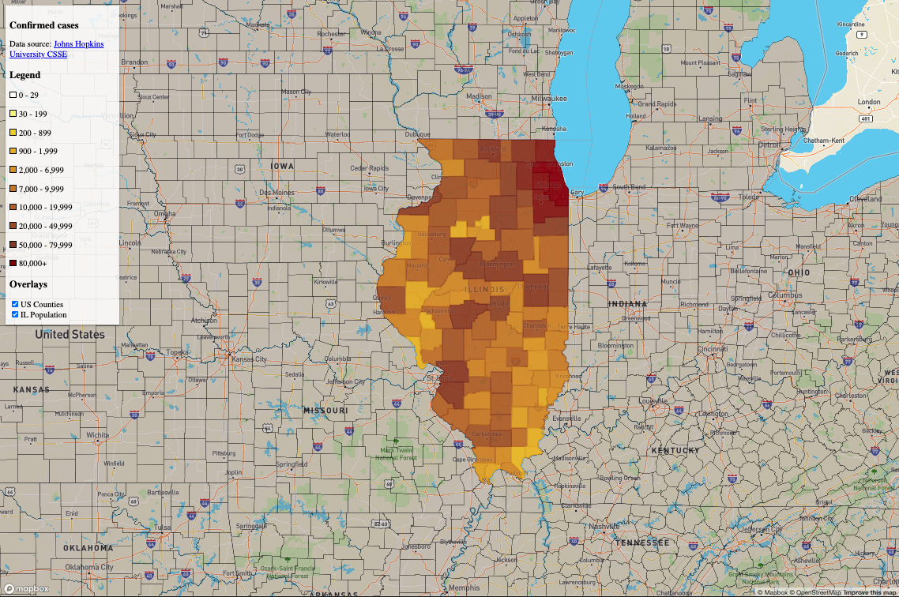

## Gen3 Map Template

This project acts as a Map template for creating map-based visualization
for inclusion into the Gen3 data portal.
This template will make adding your visualization easier to
a Gen3 based data portal. You can use this project as the
basis for your own data visualization by changing the data
and the Layer definitions to match your data and visualization
style.

The template is written in [Typescript](https://www.typescriptlang.org/) and is
based on [React](https://reactjs.org/), [MapBox](www.mapbox.com), and
uses [npm](https://www.npmjs.com).

To develop a map based visualization look at src/BaseMap/index.jsx.
It is composed of the following elements:


#### Data
Data for any mapping project needs to be geospatial
data in GeoJSON format,
one of two formats that MapBox accepts. In the
template, the data is imported into a JSON object. O
ther methods would include reading from an AWS S3 bucket
or a URL. For inclusion into Gen3 the data files must be in
GeoJSON format and not read from a database or other service.

#### Map Component
The [InteractiveMap](https://visgl.github.io/react-map-gl/docs/api-reference/interactive-map) component
is a Mapbox based map. It requires for you to supply a MapBox token
detail of which are described below. You do not need to make
any changes to the mapboxToken in this file.

#### Data Source and Layer
To display your data on top of a MapBox map you need
to define a Data Source and a Layer. The Datasource is used
to load your GeoJSON map data and the Layer is used to
render some or all of the data.

Layer uses the MapBox style [definition](https://docs.mapbox.com/mapbox-gl-js/style-spec/)
which is flexible enough to render a wide variety of different
styles of visualization. In addition it support filter operations
which allows you to use a single datasource to render multiple Layers.
You can also add you own processing to the data but for
many operation using so called [Data Driven Styling](https://docs.mapbox.com/help/getting-started/map-design/#data-driven-styles)
is more efficient due to MapBox's render optimization. The template has an example of data driven styling.


## Installation

To install the template you will need npm

To install type the following:
```
npm install
```

You will also need to set up a Mapbox token which is needed
to access their services. You can obtain a Mapbox token and free access
[here](https://docs.mapbox.com/help/getting-started/access-tokens/).
To do this, create a .env file in the template
root level directory and add the line:
```
MAPBOX_API_TOKEN=your mapbox token
```
where you replace *your mapbox token* with the appropriate
Mapbox token.

You will see some warnings, however you should be able safely ignore them.
Assuming the installation complete without errors, you can start
a webserver by:
```
npm start
```

you see something similar to:
```
> gdc-map-template@0.1.0 start .. .../Projects/CTDS/gen3/data-portal/..
> webpack-dev-server --mode development

ℹ ｢wds｣: Project is running at http://localhost:8081/
ℹ ｢wds｣: webpack output is served from /
ℹ ｢wds｣: Content not from webpack is served from ./dist
ℹ ｢wdm｣: Hash: 5c1e470f2e6c21006fdf
Version: webpack 4.46.0
.
.
.
ℹ ｢wdm｣: Compiled successfully.

```
You can access the url shown above
(the port number might be different) and should see something
like:



### Creating a new Overlay

Creating a new overlay require that you defined a GeoJson data source,
style it and then add it to the map. To create a new overlay
create a new directory in ```data-portal/src/Covid19Dashboard/overlays```.
Copy ```data-portal/src/Covid19Dashboard/overlays/LayerTemplate/index.jsx```
to your new directory.

#### Add Datasource

You will need to add you datasource to the layer. This can be done in
several ways, the easiest being to add a local geojson file. NOTE:
need official way to add S3 files.

Look for the code:
```javascript
  render() {
    return (
      <ReactMapGL.Source type='geojson' data={usCounties}>
        <ReactMapGL.Layer {...notIl} layout={{ visibility: this.props.visibility }}/>
      </ReactMapGL.Source>
    );
```

change the ```data=``` property to point to your data source.

#### Set a Style

Now that you have added the datasource, you will need to tell
mapbox how to render it. As described above this is done by defining
a Mapbox *style* which sets properties such as color, outlines, and what to
draw (line, polygons, markers, etc.). A full Mapbox style can be quite
large, you only need to define the style for the data needed for
the overlay. One suggestion to help create style files is to either
Mapbox studio or [Maputnik](https://maputnik.github.io/editor/#0.61/0/0)
where you can add your data and develop the styling before
adding to the overlay layer.

Once you style is defined, you can import it as a json object
and assign it to the layer. In the code fragment above
the style is added using the javascript spread operator
```javascript <ReactMapGL.Layer {...<style object here>} ```. Note
that it need to be placed **before** the layout property.

#### Add the Illinois Map

The remaining step is to add the LOverlay to the Illinois map.
To do this open ```data-portal/src/Covid19Dashboard/IllinoisMapChart/index.jsx```.
Then do the following steps:
1. Import your overlay.
```javascript
import MyOverlay from '../overlays/MyOverlay';
```

2. Add information about your overlay to the overlay_layer state.
This is a json object with a unique id and two members, ~title~ and
   ~visible which can be set to 'visible' or 'none'.

```javascript
 overlay_layers: {
  ...
  us_counties : { title: 'US Counties', visible: 'visible' },
 }
```

3. TODO: Add you data source/loading function

4. Add the imported layer to the map by going to the
closing tag for ReactGL.InteractiveMap:
```javascript
        <MyOverlay visibility={this.state.overlay_layers.us_counties.visible} />
        </ReactMapGL.InteractiveMap>
```
where the this.state.overlay_layers.<you added id>.visible is the
name of the object you added in step 2.

If everything is successful you should see a map with a layer selection
as show in the image above.
